# アーキテクチャ図

Phase 1+2 完成時点のシステム構造リファレンス。
Phase 3 以降の実装プロンプト作成・実装箇所の判断に使う。

**最終更新: 2026-05-11 (Phase 4c 完成時点)**

---

## 目次

1. [全体像 — 3層アーキテクチャ](#1-全体像--3層アーキテクチャ)
2. [シーン構成と Canvas Sort Order](#2-シーン構成と-canvas-sort-order)
3. [Domain Layer 詳細](#3-domain-layer-詳細)
   - 3.5 [判定パイプライン (Phase 4-pre)](#35-判定パイプライン-phase-4-pre)
4. [Unity Layer 詳細](#4-unity-layer-詳細)
   - 4.1b [GamePlay シーン — Live/Replay 分岐 (Phase 4a)](#41b-gameplay-シーン--livereplay-分岐-phase-4a)
5. [起動・遷移・プレイのシーケンス](#5-起動遷移プレイのシーケンス)
6. [依存関係マップ](#6-依存関係マップ)
7. [シーン一覧と役割](#7-シーン一覧と役割)
8. [_Persistent 常駐サービス一覧](#8-persistent-常駐サービス一覧)
9. [Phase 別実装スコープ](#9-phase-別実装スコープ)
10. [ファイル別早見表](#10-ファイル別早見表)

---

## 1. 全体像 — 3層アーキテクチャ

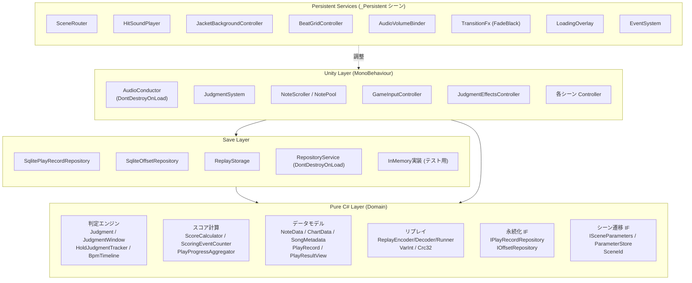

**設計原則**

| 層 | 依存 | 再利用性 |
|---|---|---|
| Domain | なし (Pure C#) | サーバーと共有可 (Phase 4 判定検証) |
| Save | Domain のみ | Repository パターンで差替え可能 |
| Unity | Domain + Save | GamePlay 専用 MonoBehaviour |
| Persistent | 全層 | DontDestroyOnLoad でシーン跨ぎ |

---

## 2. シーン構成と Canvas Sort Order

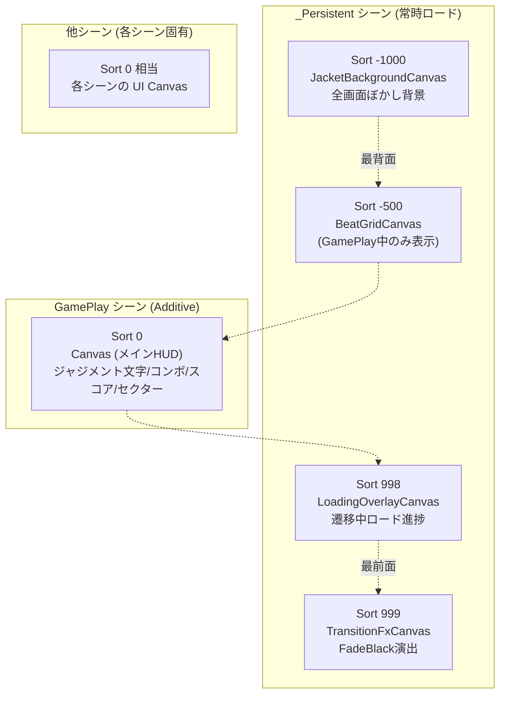

**レイヤーの意図**

| Sort Order | Canvas | 表示シーン | 役割 |
|---|---|---|---|
| -1000 | JacketBackgroundCanvas | 全シーン | ジャケット画像の全画面ぼかし背景 |
| -500 | BeatGridCanvas | GamePlay のみ | BPM同期パルスグリッド |
| 0 | 各シーン Canvas | 各シーン | HUD / 判定テキスト / コンボ / 選曲UI 等 |
| 700 | ReplayHudCanvas | GamePlay (Replay中) | リプレイ再生中のみ active — 再生速度・▶/❚❚ |
| 998 | LoadingOverlayCanvas | 遷移中 | ローディング進捗バー |
| 999 | TransitionFxCanvas | 遷移中 | FadeBlack (0.3s) |

---

## 3. Domain Layer 詳細

### 3.1 判定エンジン

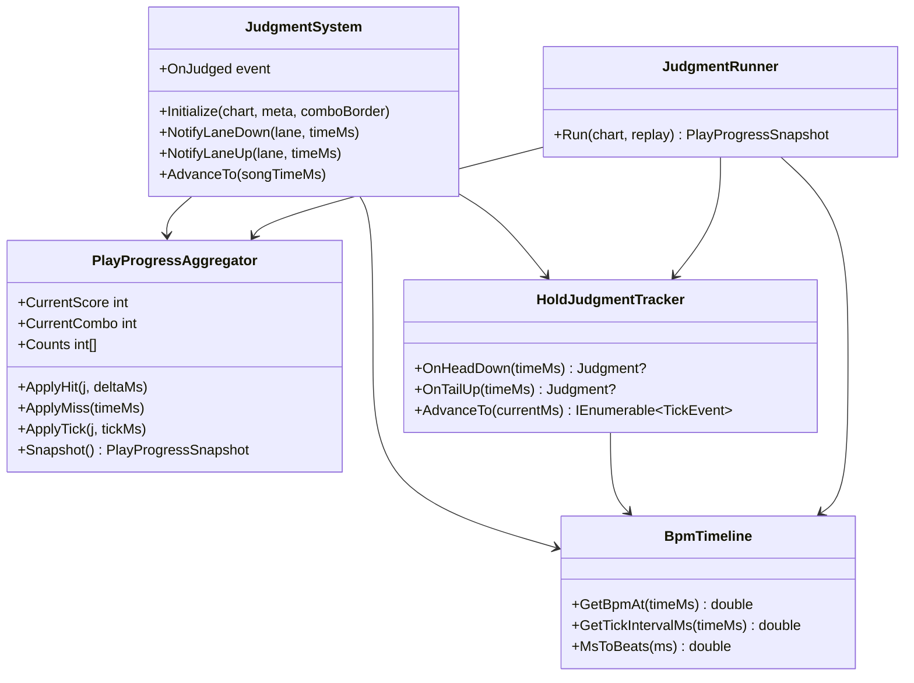

### 3.2 スコア計算

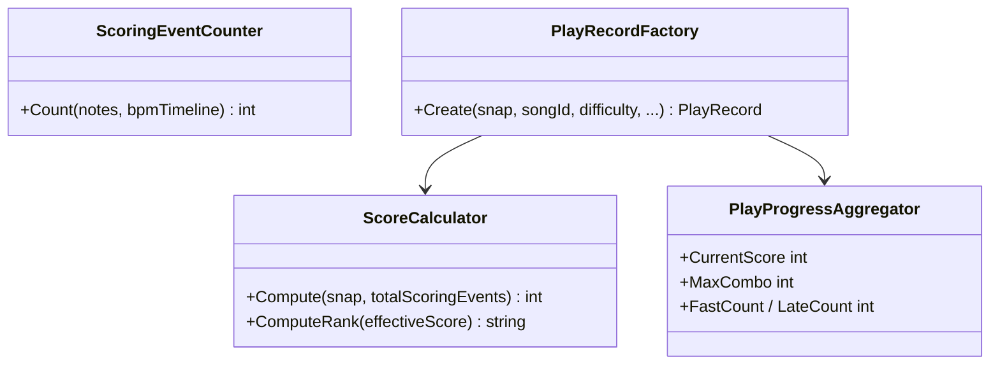

スコア理論値: **1,000,000点**
ランク: S+(99.7%) / S(99%) / A+(95%) / A(90%) / B(80%) / C(70%) / D(70%未満)

### 3.3 リプレイシステム

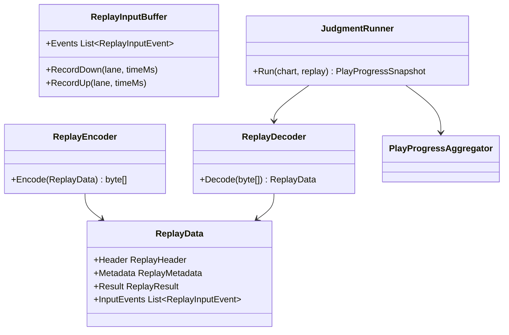

バイナリ形式: VarInt + Crc32 チェックサム

### 3.4 永続化インターフェース

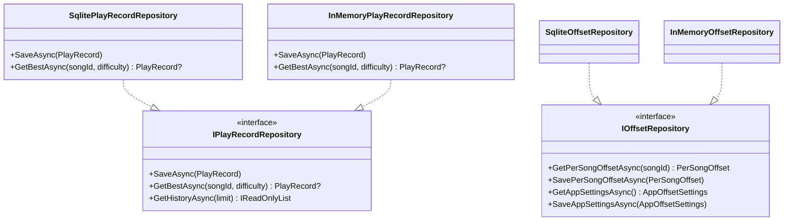

### 3.5 判定パイプライン (Phase 4-pre)

Phase 4-pre で「判定ロジックが2本ある」問題を解消し、`JudgmentEngine` に統一した。

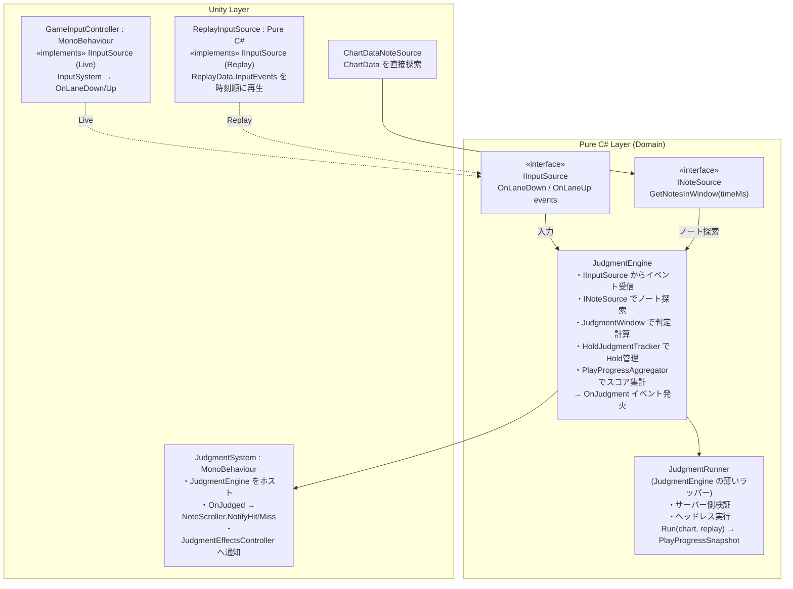

**設計の意図**

| 変更前 (Phase 2 以前) | 変更後 (Phase 4-pre) |
|---|---|
| `JudgmentSystem` が入力をキャプチャ + 判定演算 | 入力は `IInputSource` 経由で注入 |
| `JudgmentRunner` が独自の判定ロジックを保持 | `JudgmentRunner` は `JudgmentEngine` を呼ぶだけ |
| Live / Replay / Server で判定コードが3本並存 | `JudgmentEngine` 1本に統一、bit-perfect |

---

## 4. Unity Layer 詳細

### 4.1 GamePlay シーンの MonoBehaviour 構成

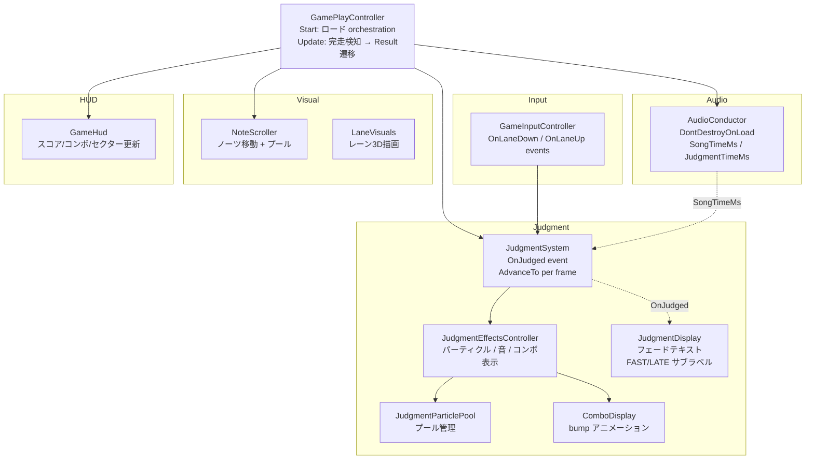

### 4.1b GamePlay シーン — Live/Replay 分岐 (Phase 4a)

`ParameterStore.IsReplay` フラグで Live / Replay の初期化パスを分岐させる設計。
共通の「ステージ初期化」は `StageInitializer` に集約し、両パスから呼ぶ。

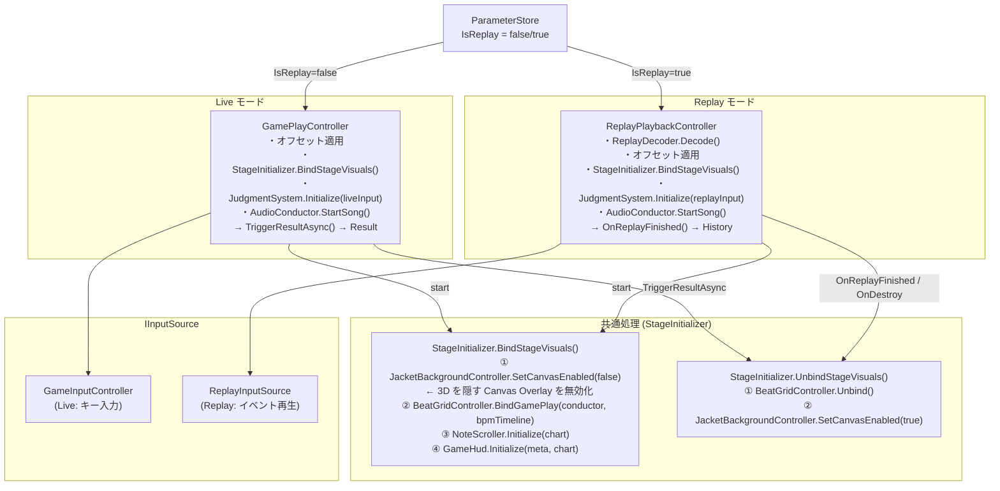

**Live と Replay の相互排除**

各 Controller の `Start()` 先頭:
```csharp
// GamePlayController
if (_params != null && _params.IsReplay) { gameObject.SetActive(false); return; }

// ReplayPlaybackController
if (prm == null || !prm.IsReplay)        { gameObject.SetActive(false); return; }
```

どちらか一方だけが動く。もう一方は自己 `SetActive(false)` して退場する。

---

### 4.2 各シーン Controller 一覧

| シーン | Controller | 主な役割 |
|---|---|---|
| Bootstrap | BootstrapController | _Persistent ロード → SceneRouter.InitialBoot() |
| Title | TitleController | メニュー選択 (FreePlay/Online/Config/History/Exit) |
| SongSelect | SongSelectController | 楽曲選択 → GamePlayParameters 設定 → GoTo(GamePlay) |
| GamePlay | GamePlayController | 譜面ロード・プレイ orchestration → GoTo(Result) |
| Result | ResultController | PlayResultView 表示 → GoTo(SongSelect/Title) |
| Config | ConfigController | 7タブ (Audio/Devices/Display/Input/Account/Game/Data) |
| History | HistoryController | プレイ履歴一覧・詳細 |

### 4.3 音声タイミングの基準クロック

```
AudioSettings.dspTime  ←── 基準クロック (Unity audio thread)
        ↓
AudioConductor.SongTimeMs
    = (dspTime - _dspStartTime) × 1000
        ↓
AudioConductor.JudgmentTimeMs
    = SongTimeMs - GlobalJudgmentOffset - PerSongOffset
        ↓
JudgmentSystem.AdvanceTo(JudgmentTimeMs)  ← 毎フレーム Update
GameInputController.OnLaneDown → JudgmentTimeMs を即取得
```

**重要**: `Time.time` / `audioSource.time` は使用禁止。dspTime 基準で統一。

---

## 5. 起動・遷移・プレイのシーケンス

### 5.1 起動シーケンス

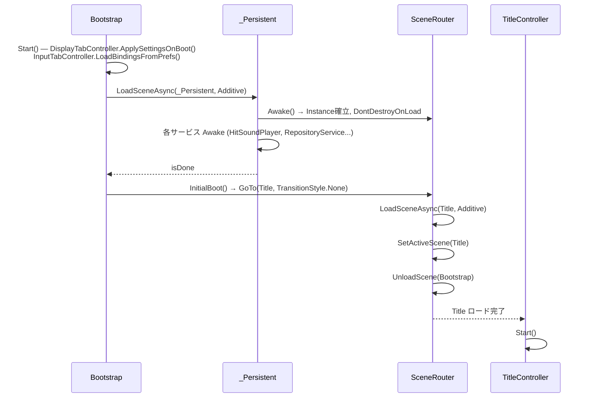

SceneAutoLoader (Editor拡張) により、▶ 押下時に常に Bootstrap から開始。

### 5.2 シーン遷移フロー (GoTo)

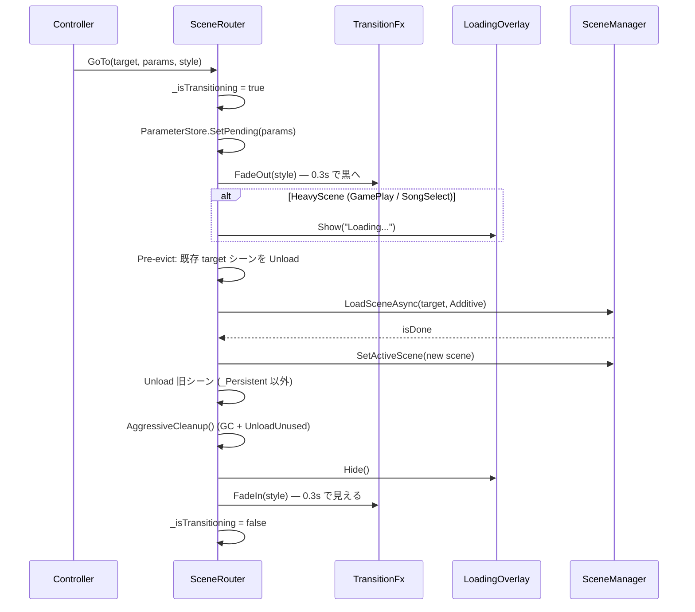

### 5.3 GamePlay プレイ中のデータフロー

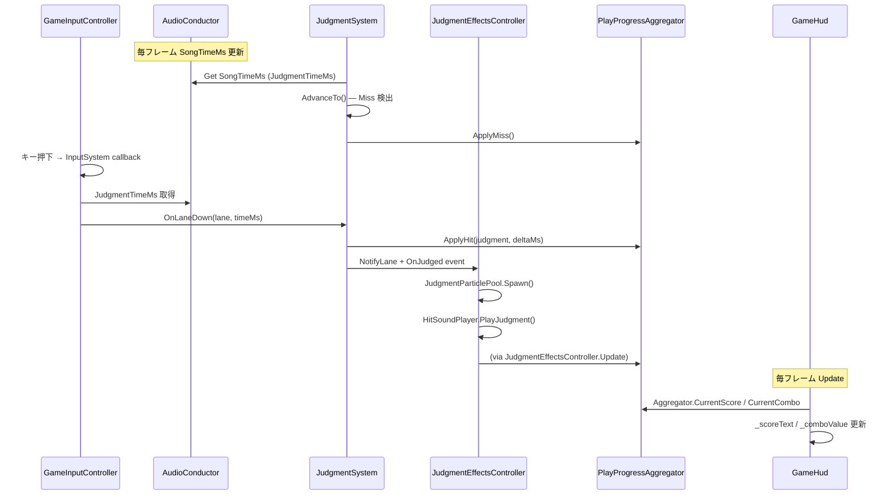

### 5.4 楽曲完走 → Result 遷移

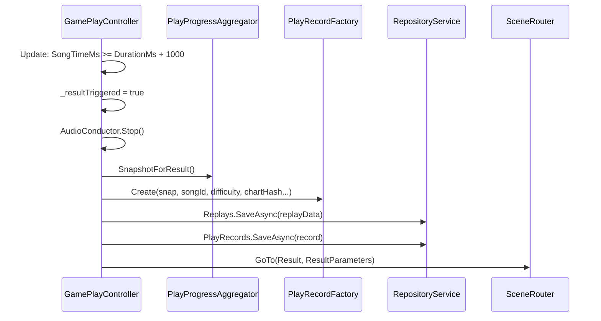

---

## 6. 依存関係マップ

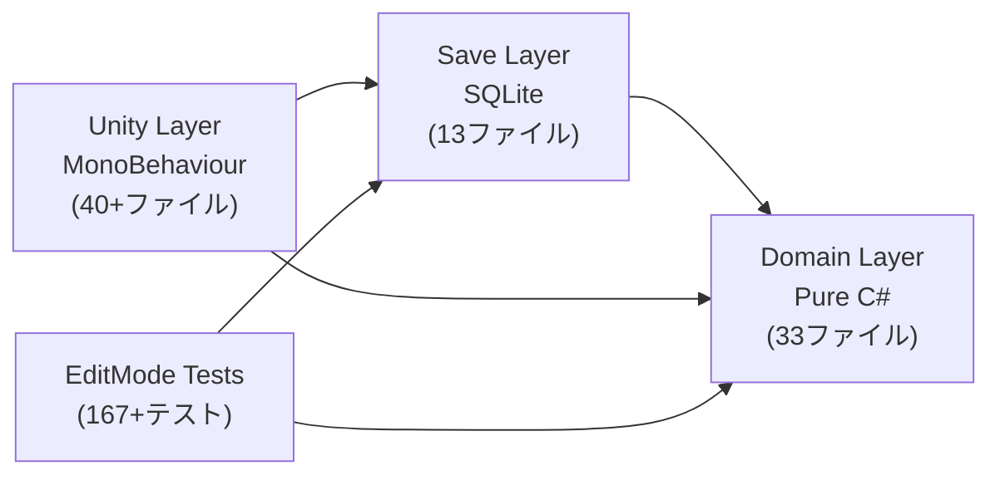

**変更影響範囲**

| 変更箇所 | 影響範囲 | 注意度 |
|---|---|---|
| Domain (インターフェース変更) | Save / Unity / Tests 全て | ⚠️ 高 |
| Domain (実装追加のみ) | Tests のみ (テスト追加) | 🟢 低 |
| Save (Repository実装) | Unity のみ (使用側) | 🟡 中 |
| Unity (MonoBehaviour) | 同シーン内のみ | 🟢 低 |
| _Persistent サービス | 全シーン | ⚠️ 高 |
| Tests | 他に波及しない | 🟢 低 |

---

## 7. シーン一覧と役割

| Build Index | シーン | 役割 | 主な Controller / Component |
|---|---|---|---|
| 0 | Bootstrap | 起動・_Persistent ロード | BootstrapController |
| 1 | _Persistent | 常駐サービス (DontDestroyOnLoad) | SceneRouter, RepositoryService 等 |
| 2 | Title | メインメニュー | TitleController |
| 3 | SongSelect | 選曲画面 (HeavyLoad) | SongSelectController |
| 4 | GamePlay | プレイ画面 (HeavyLoad) | GamePlayController |
| 5 | Result | リザルト | ResultController |
| 6 | Config | 設定 (7タブ) | ConfigController + 各TabController |
| 7 | History | プレイ履歴 | HistoryController |

HeavyLoad シーン (SongSelect / GamePlay) は SceneRouter の遷移中に LoadingOverlay を表示。

---

## 8. _Persistent 常駐サービス一覧

_Persistent.unity のルート GameObject 全一覧:

| GameObject | コンポーネント | 役割 |
|---|---|---|
| SceneRouter | SceneRouter, AudioListener | シーン遷移管理 (Singleton), 永続 AudioListener |
| HitSoundPlayer | HitSoundPlayer, AudioSource | タップ音・判定音再生 |
| JacketBackgroundCanvas | JacketBackgroundController, Canvas | Sort -1000, 全画面ぼかし背景 |
| BeatGridCanvas | BeatGridController, Canvas | Sort -500, BPMグリッド (GamePlay 中のみ) |
| TransitionFxCanvas | TransitionFx, Canvas, CanvasGroup | Sort 999, FadeBlack 遷移演出 |
| LoadingOverlayCanvas | LoadingOverlay, Canvas | Sort 998, HeavyLoad 中の進捗表示 |
| AudioVolumeBinder | AudioVolumeBinder | AudioMixer へのボリューム設定同期 |
| EventSystem | EventSystem, InputSystemUIInputModule | UIイベント処理 (全シーン共通) |

RepositoryService は `DontDestroyOnLoad` で GamePlay シーンからも永続化される (SQLite接続保持)。

---

## 9. Phase 別実装スコープ

### Phase 1 完成 (167 EditMode テスト Pass)
- **判定エンジン**: Judgment / JudgmentWindow / HoldJudgmentTracker / BpmTimeline
- **スコア計算**: ScoreCalculator / ScoringEventCounter / PlayProgressAggregator
- **永続化基盤**: IPlayRecordRepository / IOffsetRepository / SQLite実装 / InMemory実装
- **リプレイ**: ReplayEncoder / Decoder / Runner / VarInt / Crc32
- **シーン遷移**: SceneRouter / ParameterStore / TransitionFx
- **UI基盤**: Title / SongSelect / GamePlay / Result / Config (7タブ) / History

### Phase 2 完成
- **背景演出**: JacketBackgroundController (ぼかし背景)
- **BPMグリッド**: BeatGridController (パルスグリッド)
- **判定エフェクト**: JudgmentEffectsController / JudgmentParticlePool / JudgmentColors
- **ヒット音**: HitSoundPlayer / HitSoundLibrary (多段ライブラリ)
- **コンボ表示**: ComboDisplay (bump アニメーション / マイルストーン金色)
- **判定テキスト**: JudgmentDisplay (フェードアウト + FAST/LATE)
- **PauseMenu**: PauseMenu (Esc キー / Resume/Restart/Quit)
- **3D レーン**: LaneVisuals / LaneLayout / NoteController / HoldNoteController
- **GameHud**: ScoreText / SectorPanel / SongInfoText / NextSongIndicator
- **デバイス監視**: WindowsAudioDeviceMonitor / DeviceProfileService

### Phase 3 (未着手)
- PVP マッチメイキング / SignalR 接続
- Matchmaking / PVPPrematch / PVPSongPick / PVPBanPhase / PVPResult / PVPMatchEnd シーン
- Glicko-2 レーティング / マッチングプール

### Phase 4-pre 完成 (判定パイプライン統一)
- **IInputSource 導入**: `GameInputController` と `ReplayInputSource` を共通インターフェースで統一
- **JudgmentEngine 統一**: `JudgmentRunner` が `JudgmentEngine` のラッパーになりロジック1本化
- **LaneRef**: Domain 層に Unity 非依存の純粋型 `LaneRef` を導入 (LaneId は Unity 境界でキャスト)
- **テスト**: JudgmentRunnerTests 等で bit-perfect 検証

### Phase 4a 完成 (リプレイ再生 UI)
- **ReplayPlaybackController**: Replay モードの GamePlay orchestration
- **StageInitializer**: Live / Replay 共通の視覚ステージ初期化を集約
- **ReplayHud**: 再生速度・一時停止表示 (Sort Order 700)
- **HistoryDetailView**: Replay ボタン追加 + ScrollRect で全項目スクロール表示
- **GamePlay シーン**: Live/Replay 相互排除の分岐設計確立

### Phase 4b 完成 (gRPC サーバー基盤)
- **Server プロジェクト**: `PVP/Server/` 配下に .NET 10 ソリューションを構築
  - `RhythmGame.Domain.csproj`: Unity の `Assets/_Project/Scripts/Domain/**/*.cs` を **csproj リンク参照**で取り込み (物理コピーなし、Nullable=disable)
  - `RhythmGame.Server.csproj`: `Grpc.AspNetCore 2.64.0` ベースの ASP.NET Core gRPC サーバー
  - `RhythmGame.Server.Tests.csproj`: xUnit によるサーバーロジックの単体テスト
- **gRPC スキーマ**: `Protos/replay.proto` で `ReplayValidation.Validate(ValidateRequest) returns ValidateResponse` を定義
- **譜面リポジトリ**: `IChartRepository` / `FileSystemChartRepository`
  - 起動時に `StreamingAssets/Songs/{song_id}/charts/{difficulty}.json` を全スキャン
  - 各譜面の SHA-256 ハッシュをキーにして `Dictionary<string, ChartEntry>` にインデックス化
  - `Program.cs` で `app.Services.GetRequiredService<IChartRepository>()` を呼び DI lazy init を回避 (起動時にログで状態確認)
- **設計上の重要事実**: Domain Layer が **Pure C# (Unity 依存ゼロ)** で .NET 10 にビルドできることを実証

### Phase 4c 完成 (リプレイ検証ロジック)
- **ReplayValidationService.Validate**: サーバー側の核心実装
  1. `ReplayDecoder.Decode` でリプレイバイナリをデコード
  2. リクエストの `ChartHash` と `replay.Metadata.ChartHash` の整合性チェック
  3. `IChartRepository` から chart / meta を取得 (未登録なら `Chart not registered`)
  4. `new JudgmentRunner().Run(chart, meta, replayData)` で **サーバー側で再判定**
  5. `PlayProgressSnapshot` → `PlayResultClaim` 変換 (Rank は `ScoreCalculator.ComputeRank` で別途算出)
  6. `CompareClaims` でクライアント主張と比較し差分を返す
- **音声ファイル不要**: 検証に必要なのは `meta.json` + `{difficulty}.json` のみ (合計 ~3-7 KB/曲)。リプレイ自体に音声は含まれず、サーバーは音声を一切読まない
- **Nullable タプル設計**: `IChartRepository.TryGetByHashAsync` の戻り値は `Task<(ChartData chart, SongMetadata meta)?>`。「見つからない = `null`」を型レベルで明示
- **テスト 6 件**: 正常系 1 件 + 異常系 3 件 + **不正検知 2 件 (スコア改竄 / コンボ改竄)**。サーバーがチート (score / combo の盛り) を検知できることを CI で担保

### Phase 4 残 (未着手)
- Step 8: Unity 側 gRPC クライアント実装 (`Grpc.Net.Client` パッケージ追加、`ReplayValidationClient` 作成)
- Step 9: End-to-end (Unity でプレイ → リプレイ送信 → サーバー検証 → HISTORY 表示)
- Replay Viewer の高機能化 (シーク / フレーム単位の巻き戻し)

---

## 10. ファイル別早見表

`Assets/_Project/Scripts/` からの相対パス。

### Domain (33ファイル)

```
Domain/
├── ChartData.cs          — NoteData / TempoEvent / SectorDef の集合体
├── ChartParser.cs        — JSON → ChartData / SongMetadata (Newtonsoft.Json)
├── ChartValidator.cs     — 譜面データの整合性チェック
├── Judgment.cs           — PerfectPlus / Perfect / Great / Good / Miss enum
├── JudgmentWindow.cs     — 判定ウィンドウ ±ms 定義
├── NoteData.cs           — Tap / Hold / FxTap / FxHold
├── ScoreCalculator.cs    — スコア計算 (1,000,000点理論値)
├── Play/
│   ├── BpmTimeline.cs            — テンポ変化に対応したBPM取得
│   ├── HoldJudgmentTracker.cs    — Hold の Head/Tick/Tail 判定
│   ├── PlayProgressAggregator.cs — リアルタイムスコア/コンボ集計
│   ├── PlayProgressSnapshot.cs   — Aggregator の瞬間スナップショット
│   ├── PlayRecord.cs             — 1プレイの完全記録
│   ├── PlayRecordFactory.cs      — Snapshot → PlayRecord 生成
│   ├── PlayResultView.cs         — Result 画面表示用 ViewModel
│   └── ScoringEventCounter.cs    — 総スコアイベント数カウント
├── Replay/
│   ├── ReplayData.cs             — Header / Metadata / Result / InputEvents
│   ├── ReplayEncoder.cs          — byte[] シリアライズ
│   ├── ReplayDecoder.cs          — byte[] デシリアライズ
│   ├── ReplayInputBuffer.cs      — プレイ中の入力録画バッファ
│   ├── JudgmentRunner.cs         — リプレイ再生 → PlayProgressSnapshot
│   ├── VarInt.cs                 — 可変長整数エンコード
│   └── Crc32.cs                  — チェックサム
├── Save/
│   ├── IPlayRecordRepository.cs  — プレイ記録 CRUD インターフェース
│   ├── IOffsetRepository.cs      — オフセット設定 CRUD インターフェース
│   ├── InMemoryPlayRecordRepository.cs
│   ├── InMemoryOffsetRepository.cs
│   ├── AppOffsetSettings.cs      — GlobalJudgmentOffset / GlobalVisualOffset
│   ├── DeviceProfile.cs          — デバイス別プロファイル
│   ├── PersonalBest.cs           — ベストスコア記録
│   └── PerSongOffset.cs          — 楽曲別オフセット
└── Scene/
    ├── ISceneParameters.cs       — シーン遷移パラメータ インターフェース
    ├── ParameterStore.cs         — 遷移前後のパラメータ一時保存
    └── SceneId.cs                — シーン識別 enum
```

### Save (13ファイル)

```
Save/
├── SqlitePlayRecordRepository.cs  — SQLite への PlayRecord 読み書き
├── SqliteOffsetRepository.cs      — SQLite へのオフセット読み書き
├── ReplayStorage.cs               — リプレイファイル保存 (Application.persistentDataPath)
├── RepositoryService.cs           — SQLite 接続管理 + DontDestroyOnLoad
├── RowMapper.cs                   — Entity ↔ DTO 変換
├── PlayerPrefsMigrator.cs         — PlayerPrefs → SQLite マイグレーション
├── PlayerPrefsOffsetMigrator.cs   — オフセット PlayerPrefs → SQLite マイグレーション
└── Tables/
    ├── PlayRow.cs
    ├── PersonalBestRow.cs
    ├── DeviceProfileRow.cs
    ├── PerSongOffsetRow.cs
    └── KeyValueRow.cs
```

### Audio (7ファイル 実装部分)

```
Audio/
├── AudioConductor.cs          — DSP時刻基準クロック, DontDestroyOnLoad
├── HitSoundPlayer.cs          — タップ音・判定音 (Singleton, DontDestroyOnLoad)
├── HitSoundLibrary.cs         — 複数音源ライブラリ (ランダム/ラウンドロビン)
├── AudioVolumeBinder.cs       — AudioMixer ← PlayerPrefs 同期
├── SineWaveGenerator.cs       — テスト用サイン波生成
└── Devices/
    ├── IAudioDeviceMonitor.cs
    ├── WindowsAudioDeviceMonitor.cs  — Windows音声デバイス変更検知
    ├── NoOpAudioDeviceMonitor.cs
    ├── DeviceProfileService.cs       — デバイス別オフセット切替
    └── NAudioCheck.cs
```

### Game (21ファイル)

```
Game/
├── GamePlayController.cs        — Live モード GamePlay オーケストレーター
├── ReplayPlaybackController.cs  — Replay モード GamePlay オーケストレーター
├── StageInitializer.cs          — Live/Replay 共通の視覚ステージ初期化 (static)
├── JudgmentSystem.cs            — 判定計算 + OnJudged イベント発火
├── NoteScroller.cs              — ノーツ移動 (VisualTimeMs 基準)
├── NotePool.cs                  — プール管理 (Tap/Hold/FxTap/FxHold)
├── NoteController.cs            — 個別ノーツ表示
├── HoldNoteController.cs        — ホールドノーツ表示 (伸縮)
├── LaneVisuals.cs               — レーン3D描画
├── LaneLayout.cs                — レーンX座標定数
├── GameInputController.cs       — InputSystem → OnLaneDown/Up (IInputSource)
├── JudgmentEffectsController.cs — エフェクト配信 (パーティクル/音/コンボ)
├── JudgmentParticlePool.cs      — 判定パーティクルプール
├── JudgmentTextPopup.cs         — 大型判定テキスト (現在使用停止)
├── JudgmentColors.cs            — 判定別カラー定数
├── JudgmentEffectStyle.cs       — エフェクトスタイル設定
├── ComboDisplay.cs              — コンボ数字 + bump アニメーション
├── ChartLoader.cs               — StreamingAssets JSON / Audio 読み込み
├── PauseMenu.cs                 — Pause UI (Resume/Restart/Quit)
└── SimpleCalibration.cs         — オフセットキャリブレーション
```

### UI (19ファイル)

```
UI/
├── Title/
│   └── TitleController.cs         — カルーセルメニュー
├── SongSelect/
│   └── SongSelectController.cs    — 選曲・難易度選択
├── Result/
│   └── ResultController.cs        — スコア/ランク表示
├── HUD/
│   └── GameHud.cs                 — スコア/コンボ/セクター更新
├── Config/
│   ├── ConfigController.cs
│   ├── AudioTabController.cs
│   ├── DevicesTabController.cs
│   ├── DisplayTabController.cs
│   ├── InputTabController.cs
│   ├── AccountTabController.cs
│   ├── GameTabController.cs
│   └── DataTabController.cs
├── JacketBackgroundController.cs  — ぼかし背景 (DontDestroyOnLoad)
├── BeatGridController.cs          — BPMグリッド (DontDestroyOnLoad)
├── JudgmentDisplay.cs             — 中央判定テキスト + FAST/LATE フェードアウト
├── JacketLoader.cs                — ジャケット画像非同期ロード
├── HudDisplay.cs                  — デバッグHUD
├── History/
│   ├── HistoryController.cs       — プレイ履歴一覧 + フィルタ
│   └── HistoryDetailView.cs       — 詳細パネル + Replay ボタン
└── Replay/
    └── ReplayHud.cs               — Sort 700, 再生速度・▶/❚❚ 表示 (Replay中のみ active)
```

### Scene (7ファイル)

```
Scene/
├── SceneRouter.cs          — GoTo / UnloadStale / AggressiveCleanup
├── BootstrapController.cs  — _Persistent ロード → InitialBoot()
├── TransitionFx.cs         — FadeBlack (FadeIn/FadeOut コルーチン)
├── LoadingOverlay.cs       — 進捗バー表示
├── AudioListenerGuard.cs   — AudioListener 重複防止 (enabled=false)
├── EventSystemGuard.cs     — EventSystem 重複防止 (Destroy)
└── TransitionStyle.cs      — None / FadeBlack enum
```

### Input (3ファイル)

```
Input/
├── GameInputController.cs  — Gameplay ActionMap → OnLaneDown/Up (IInputSource 実装)
│                             境界で (LaneRef)(int)lane キャストを担う
├── LaneId.cs               — Lane0/1/2/3/FxL/FxR enum (Unity 依存、境界専用)
└── InputTestUI.cs          — デバッグ用入力テストUI
```

Domain/Input (Pure C#):
```
Domain/Input/
├── IInputSource.cs         — OnLaneDown / OnLaneUp イベントのインターフェース
└── ReplayInputSource.cs    — ReplayData.InputEvents を時刻順に再生 (Replay専用)
```

### Editor (2ファイル)

```
Editor/
├── SceneAutoLoader.cs      — ▶ 押下時に Bootstrap から開始する Editor拡張
└── TestAudioGenerator.cs   — Tools > Generate Test Audio (65秒サイン波WAV)
```

### Tests (EditMode)

```
Tests/EditMode/
├── JudgmentWindowTests.cs
├── ScoreCalculatorTests.cs
├── ChartParserTests.cs
├── PlayProgressAggregatorTests.cs
├── HoldJudgmentTrackerTests.cs
├── PlayRecordFactoryTests.cs
├── ParameterStoreTests.cs
├── InMemoryPlayRecordRepositoryTests.cs
├── InMemoryOffsetRepositoryTests.cs
├── AppOffsetSettingsTests.cs
├── ReplayEncoderTests.cs
├── ReplayDecoderTests.cs
├── JudgmentRunnerTests.cs
├── ScoringEventCounterTests.cs
├── SQLiteIntegration/
│   ├── TempSqliteDb.cs              — テスト用一時DB
│   └── SqliteOffsetRepositoryTests.cs
└── Helpers/
    ├── ChartBuilder.cs  — テスト用 ChartData 生成ヘルパー
    └── ReplayBuilder.cs — テスト用 ReplayData 生成ヘルパー
```

---

*このドキュメントは実コードから生成。Phase 3 実装開始時に更新予定。*
