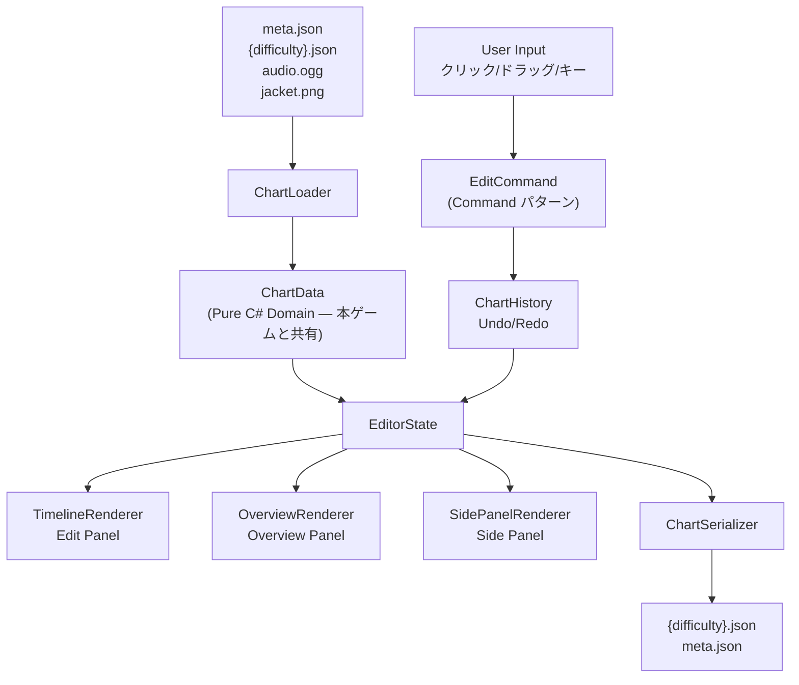

# 譜面エディタ (ChartEditor) 設計書

Unity リズムゲーム本体に対応する譜面制作アプリ "ChartEditor" の設計書。
実装は Editor Phase 1 から開始予定。

**最終更新: 2026-05-10 (本ゲーム Phase 2 完成時点で着手)**
**ステータス: 設計確定、実装未着手**

関連ドキュメント:
- 本ゲーム アーキテクチャ図: `docs/architecture/architecture.md`
- 本ゲーム ハンドブック: `docs/handbook.md`
- 本ゲーム トラブルシューティング: `docs/troubleshooting.md`
- 本ゲーム 設計書PDF: `OneDrive/デスクトップ/rhythm_game_design.pdf`

---

## 目次

1. [プロジェクト概要](#1-プロジェクト概要)
2. [リポジトリ構成](#2-リポジトリ構成)
3. [全体レイアウト (ハイブリッドUI)](#3-全体レイアウト-ハイブリッドui)
4. [Phase 別実装スコープ](#4-phase-別実装スコープ)
5. [技術仕様](#5-技術仕様)
6. [データフロー](#6-データフロー)
7. [リスク・課題](#7-リスク課題)
8. [ディレクトリ構造](#8-ディレクトリ構造)
9. [キーバインド](#9-キーバインド)
10. [次回チャットでの開始手順](#10-次回チャットでの開始手順)
- [付録 A: chart.json フォーマット](#付録-a-chartjson-フォーマット)
- [付録 B: 命名候補](#付録-b-命名候補)

---

## 1. プロジェクト概要

### 1.1 名称と目的

**名称 (仮): ChartEditor**

目的:
- 本ゲーム用の `{difficulty}.json` 譜面ファイルを作成・編集する
- 楽曲メタ情報 (`meta.json`) も同時管理
- 自分専用 + 将来的に外部の譜面職人へ配布

### 1.2 配信形態

スタンドアロン Windows アプリ (Unity 6、URP、uGUI)
本ゲームと同じ Git リポジトリ内 `Tools/ChartEditor/` に配置

### 1.3 想定期間

| Phase | 内容 | 期間 |
|-------|------|------|
| Editor Phase 1 | コア機能 | 1〜2ヶ月 |
| Editor Phase 2 | 編集効率化 | 1ヶ月 |
| Editor Phase 3 | 補助機能 | 1〜2ヶ月 |
| Editor Phase 4 | 配布準備 | 数週間 |
| **合計** | | **3〜6ヶ月相当** |

---

## 2. リポジトリ構成

```
RhythmGame/                          (Git リポジトリルート)
├── Assets/                          (本ゲーム Unityプロジェクト)
│   └── _Project/
│       └── Scripts/Domain/          (Pure C# Domain層 — 本物)
├── Tools/                           (新規)
│   └── ChartEditor/
│       ├── Assets/_Project/
│       │   ├── Scripts/
│       │   │   ├── Domain/          (本ゲームから自動コピー)
│       │   │   ├── Editor/          (Editor固有スクリプト)
│       │   │   └── ...
│       │   ├── Scenes/
│       │   └── ...
│       ├── ProjectSettings/
│       ├── Packages/
│       └── sync_domain.py           (Domain層コピー自動化)
├── docs/
│   ├── architecture/architecture.md
│   ├── handbook.md
│   ├── troubleshooting.md
│   ├── design_doc/
│   └── chart_editor/
│       └── editor_design.md         (このファイル)
└── OneDrive/デスクトップ/
    └── rhythm_game_design.pdf        (設計書本体 72ページ)
```

> 現在の Unity プロジェクトパス: `C:/Users/CaSte/PVP/`
> `Tools/ChartEditor/` は本ゲームの Phase 2 完成後に新規作成する。

### 2.1 Domain層共有の仕組み

`sync_domain.py` の動作:
1. `Assets/_Project/Scripts/Domain/` から再帰的に `.cs` と `.meta` をコピー
2. `Tools/ChartEditor/Assets/_Project/Scripts/Domain/` に上書き
3. 各ファイル先頭に `// AUTO-GENERATED — DO NOT EDIT` コメントを挿入

実行タイミング:
- 本ゲーム側で Domain層を変更したら手動実行
- Editor 起動時の自動実行は将来検討

---

## 3. 全体レイアウト (ハイブリッドUI)

```
┌─────────────────────────────────────────────────────┐
│  [File] [Edit] [View] [Tool] [Help]    Menu Bar      │
├─────────────────────────────────────────────────────┤
│  ▶ ❚❚  BPM: 180  Snap: 1/4  Easy▼  [Save]  Toolbar  │
├──────────┬──────────────────────────────────────────┤
│          │  ≈≈≈≈ Overview Panel (俯瞰) ≈≈≈≈≈≈≈≈≈≈  │
│  Side    │  [波形サムネイル / ノーツ密度 / 位置マーカー]  │
│  Panel   ├──────────────────────────────────────────┤
│  (左)    │                                          │
│          │        Edit Panel (編集・縦タイムライン)   │
│ ・ノーツ詳細│                                          │
│ ・メタ情報 │  L0  L1  L2  L3  FxL  FxR              │
│ ・統計    │  │   │   │   │   │    │                 │
│          │  ■   │   ■   │   │    ■   ← ノーツ      │
│          │  │   ■   │   ■   ■    │                 │
│          │  ▼   ▼   ▼   ▼   ▼    ▼  (時間 →下)    │
├──────────┴──────────────────────────────────────────┤
│  00:42.350  Notes: 312  NPS: 8.2  chart_easy.json  │
│                                         Status Bar  │
└─────────────────────────────────────────────────────┘
```

### 3.1 Menu Bar

| メニュー | 主な項目 |
|----------|---------|
| File | New / Open / Save / Save As / Export / Recent |
| Edit | Undo / Redo / Cut / Copy / Paste / Select All / Delete |
| View | Zoom In/Out / Snap / Waveform / Grid / Panel表示切替 |
| Tool | Beat Detect / Mirror / Auto Place / Validate |
| Help | KeyBindings / About / Open docs/ |

### 3.2 Toolbar

再生コントロール (Play/Pause/Stop)、BPM表示、Snap選択、難易度切替、Save ボタン

### 3.3 Side Panel (左)

- 選択中ノーツ詳細 (タイプ / レーン / TimeMs / DurationMs)
- 楽曲メタ情報編集 (タイトル / アーティスト / BPM / 難易度レベル)
- 統計情報 (ノーツ数 / NPS / Sector 別内訳)

### 3.4 Overview Panel (上、俯瞰)

- 楽曲全体波形サムネイル
- ノーツ密度サムネイル
- 現在位置マーカー (ドラッグでシーク)
- Sector 境界、BPM 変更点の表示

### 3.5 Edit Panel (下、編集メイン)

- **縦タイムライン**: 上 → 下に時間進行 (本ゲームのノーツ落下と逆方向で直感的)
- **横にレーン**: Lane0 / Lane1 / Lane2 / Lane3 / FxL / FxR
- ノーツがブロック (Tap) または帯 (Hold) として描画
- 拍線・小節線・拍数ラベル表示
- 楽曲波形を背景に薄く重ね描画

### 3.6 Status Bar

現在時刻 (mm:ss.mmm) / 総ノーツ数 / NPS / 編集中ファイル名

---

## 4. Phase 別実装スコープ

### 4.1 Editor Phase 1: コア機能 (1〜2ヶ月)

| タスク | 概要 |
|--------|------|
| E1-1 | 新 Unity プロジェクト立ち上げ (`Tools/ChartEditor/`) |
| E1-2 | Domain 層共有の仕組み (`sync_domain.py`) |
| E1-3 | 楽曲ロード + 波形表示 |
| E1-4 | ハイブリッド UI レイアウト構築 |
| E1-5 | ノーツ配置 — Tap |
| E1-6 | ノーツ配置 — Hold |
| E1-7 | ノーツ配置 — FxTap / FxHold |
| E1-8 | 再生 + プレビュー (簡易版) |
| E1-9 | `{difficulty}.json` 保存・読込 |
| E1-10 | 本ゲームと同じレンダリングのプレビュー |

### 4.2 Editor Phase 2: 編集効率化 (1ヶ月)

| タスク | 概要 |
|--------|------|
| E2-1 | Undo / Redo |
| E2-2 | コピペ・領域選択 |
| E2-3 | BPM 変更点配置 |
| E2-4 | Sector 境界配置 |
| E2-5 | 楽曲メタ情報編集 (`meta.json`) |
| E2-6 | 複数難易度対応 (Easy / Normal / Hard / Extra) |
| E2-7 | スナップ強化 (1/4, 1/8, 1/16, 1/32, 自由) |
| E2-8 | ジャケット画像取り込み |

### 4.3 Editor Phase 3: 補助機能 (1〜2ヶ月)

| タスク | 概要 |
|--------|------|
| E3-1 | ビート検出 (FFT ベース) |
| E3-2 | 自動配置補助 |
| E3-3 | 統計表示 (NPS グラフ / Sector 別) |
| E3-4 | ミラー反転 |
| E3-5 | テストプレイ統合 (本ゲーム起動) |
| E3-6 | 書き出し検証 (ChartParser 経由の往復テスト) |

### 4.4 Editor Phase 4: 配布準備 (数週間)

| タスク | 概要 |
|--------|------|
| E4-1 | ビルド設定 (Windows スタンドアロン) |
| E4-2 | README / ユーザードキュメント |
| E4-3 | 配布形態 (GitHub Releases → 将来 itch.io / Steam) |

---

## 5. 技術仕様

| 項目 | 採用 |
|------|------|
| Unity バージョン | Unity 6 (6000.3.14f1、本ゲームと揃える) |
| レンダリング | URP |
| UI | uGUI (Canvas + RectTransform) |
| 入力 | New Input System |
| データ | `meta.json` + `{difficulty}.json` + `editor_state.json` |
| ライブラリ | TextMeshPro / System.Text.Json / NAudio (波形) |

**パフォーマンス目標:**
- 楽曲ロード: 数 MB → 5 秒以内
- 編集操作: 60 fps 維持
- ノーツ 500 個でも軽快

---

## 6. データフロー



**重要な設計方針:**
- `ChartData` は本ゲーム Domain 層と完全共有 (= `sync_domain.py` で同期)
- `EditCommand` は Command パターン実装、全編集操作をラップ
- `EditorState` は保存前の「作業中データ」、UI はここだけ参照

---

## 7. リスク・課題

### 7.1 技術的リスク

| リスク | 緩和策 |
|--------|--------|
| Domain 層の同期漏れ | 起動時自動同期 or CI で diff チェック、手順を README に明記 |
| 楽曲ロード時のメモリ消費 | NAudio ストリーミング + 部分ロード |
| 大量ノーツ時のレンダリング負荷 | Canvas 分割、可視範囲のみ描画 (仮想スクロール) |
| FFT ビート検出の精度 | Phase 3 で実装、不安定なら手動補助に留める |

### 7.2 設計上の課題

| 課題 | 緩和策 |
|------|--------|
| 本ゲーム / エディタ間の Domain 層乖離 | ファイル先頭にバージョン埋め込み、互換性チェック実装 |
| 複数難易度の UI 複雑化 | 1 度に 1 難易度のみ編集、切替時に保存確認ダイアログ |

### 7.3 開発リソース

一人開発で 3〜6 ヶ月の継続コミットが必要。
**緩和策:** Phase 分割で各 Phase 終了時点で動くものを完成させる。途中中断しても再開できるよう、このドキュメントと `editor_state.json` で状態を保持。

---

## 8. ディレクトリ構造

```
Tools/ChartEditor/Assets/_Project/Scripts/
├── Domain/                          (本ゲームから自動コピー — 手動編集禁止)
│   ├── Chart/
│   │   ├── ChartData.cs
│   │   ├── NoteData.cs
│   │   ├── ChartParser.cs
│   │   └── ...
│   └── ...
└── Editor/                          (Editor 固有)
    ├── State/
    │   ├── EditorState.cs           (編集中の状態保持)
    │   ├── ChartHistory.cs          (Undo/Redo スタック)
    │   └── EditCommand.cs           (Command パターン基底)
    ├── Serialization/
    │   ├── ChartSerializer.cs       (NoteData → JSON 書き出し)
    │   └── ChartLoader.cs           (本ゲーム ChartParser を流用)
    ├── Rendering/
    │   ├── TimelineRenderer.cs      (Edit Panel — 縦タイムライン)
    │   ├── OverviewRenderer.cs      (Overview Panel — 俯瞰)
    │   └── WaveformRenderer.cs      (楽曲波形描画)
    ├── Input/
    │   ├── EditorInputController.cs
    │   └── KeyBindings.cs
    ├── UI/
    │   ├── MenuBar/
    │   ├── Toolbar/
    │   ├── SidePanel/
    │   ├── OverviewPanel/
    │   ├── EditPanel/
    │   └── StatusBar/
    ├── Audio/
    │   ├── EditorAudioPlayer.cs
    │   └── BeatDetector.cs          (Phase 3)
    ├── Tools/
    │   ├── AutoPlacer.cs            (Phase 3)
    │   ├── MirrorTool.cs            (Phase 3)
    │   └── StatisticsCalculator.cs  (Phase 3)
    └── Preview/
        └── PreviewPlayer.cs

Tools/ChartEditor/Assets/_Project/Tests/EditMode/
├── ChartSerializerTests.cs
├── EditCommandTests.cs
└── ChartLoaderRoundtripTests.cs
```

---

## 9. キーバインド

| キー | 動作 |
|------|------|
| `Space` | Play / Pause |
| `Ctrl+Z` | Undo |
| `Ctrl+Y` | Redo |
| `Ctrl+S` | Save |
| `Ctrl+O` | Open |
| `Ctrl+N` | New |
| `Ctrl+C` | Copy |
| `Ctrl+V` | Paste |
| `Ctrl+X` | Cut |
| `Ctrl+A` | Select All |
| `Delete` | 選択ノーツ削除 |
| `1` / `2` / `3` / `4` | Lane 0 〜 3 選択 |
| `5` / `6` | FxL / FxR 選択 |
| `Tab` | Tap / Hold モード切替 |
| `↑` / `↓` | スクロール |
| `Page Up` / `Page Down` | 大スクロール |
| `Home` / `End` | 楽曲先頭 / 末尾へ |
| `F5` | テストプレイ |
| `F11` | フルスクリーン |

---

## 10. 次回チャットでの開始手順

このチャット (Phase 2 完成 + ドキュメント整備 + 譜面エディタ設計) を `/compact` しておく。

**次回チャット冒頭で:**
1. このドキュメント (`docs/chart_editor/editor_design.md`) を共有 or 参照
2. `docs/architecture/architecture.md` も合わせて参照
3. Editor Phase 1 の **E1-1 (新 Unity プロジェクト立ち上げ)** から実装開始

**実装の進め方 (本ゲーム Phase 1+2 と同じ方式):**
- 各タスク: ラフ設計 → 確認 → 詳細仕様 → 実装プロンプト
- 詰まったら本ゲームの `docs/troubleshooting.md` のデバッグ手法を流用

---

## 付録 A: chart.json フォーマット (本ゲーム流用)

本ゲームの `ChartParser.cs` / `ChartSerializer.cs` が読み書きする形式をそのまま使用。

**ファイル分割:**
```
StreamingAssets/Songs/{song_id}/
├── meta.json           (楽曲メタ情報、全難易度共有)
├── easy.json           (難易度ごとのノーツデータ)
├── normal.json
├── hard.json
├── extra.json
├── audio.ogg
└── jacket.png
```

**meta.json:**
```json
{
  "songId": "test_song",
  "title": "Test Song",
  "artist": "Artist Name",
  "bpmDisplay": 180.0,
  "previewStartMs": 30000,
  "difficulties": {
    "easy":   { "level": 3, "noteDesigner": "Designer" },
    "normal": { "level": 6, "noteDesigner": "Designer" },
    "hard":   { "level": 9, "noteDesigner": "Designer" },
    "extra":  { "level": 12, "noteDesigner": "Designer" }
  }
}
```

**{difficulty}.json 必須フィールド:**
```json
{
  "notes": [
    { "id": 0, "type": "tap",  "lane": 0, "timeMs": 1000 },
    { "id": 1, "type": "hold", "lane": 1, "timeMs": 2000, "durationMs": 500 },
    { "id": 2, "type": "fxTap",  "lane": 4, "timeMs": 3000 },
    { "id": 3, "type": "fxHold", "lane": 5, "timeMs": 4000, "durationMs": 1000 }
  ],
  "events": [
    { "type": "bpm", "timeMs": 0, "bpm": 180.0 }
  ],
  "sectors": [
    { "index": 0, "endMs": 30000 },
    { "index": 1, "endMs": 60000 },
    { "index": 2, "endMs": 90000 },
    { "index": 3, "endMs": 120000 },
    { "index": 4, "endMs": 150000 }
  ],
  "editorMeta": {
    "version": "1.0.0",
    "createdAt": "2026-05-10T00:00:00Z",
    "modifiedAt": "2026-05-10T00:00:00Z",
    "author": "CaSte"
  }
}
```

**レーン番号対応:**

| lane 値 | 対応レーン |
|---------|----------|
| 0 | Lane 0 (左端) |
| 1 | Lane 1 |
| 2 | Lane 2 |
| 3 | Lane 3 (右端) |
| 4 | FxL |
| 5 | FxR |

---

## 付録 B: 命名候補

| 候補 | 備考 |
|------|------|
| **ChartEditor** | シンプル、現時点での推奨 |
| BeatCraft Editor | 創作感を強調 |
| (本ゲームタイトル) Editor | 本ゲーム名が決まったらそれに合わせる |
