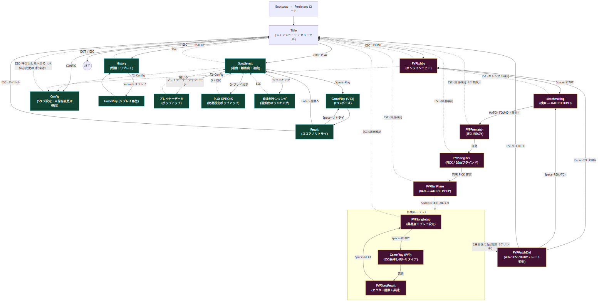

# 画面遷移図（全画面・操作仕様つき）

> 正本フロー（PVP対戦）: `C:\Users\CaSte\OneDrive\デスクトップ\フロー.png`（ユーザー提供）
> 配色規約: **自分 = シアン `#2BD9E6`（左） / 相手 = レッド `#F24D6B`（右）**、基調は DJMAX 風
> 最終更新: 2026-06-07 (2回目) — 図を実装に追従: Config を**5タブ**表記に変更（モック適用・§10）+ **未保存変更の3択確認**を明記（§10-1）+ SongSelect に **PLAY OPTIONS（簡易設定ポップアップ・O キー）** を追加（§11）。
> 同日(1回目): ①Config 入口3箇所化（ESC=呼び出し元復帰） ②PVPMatchEnd 到達2系統明確化 ③プレイヤーデータポップアップ ④楽曲別ランキング画面

このドキュメントは「画面遷移」と「各画面の操作（キーボード / ESC / ゲームパッド / ボタン）」を一体で定義する。
凡例: **(済)** = 現状コードに実装済み / **(新)** = 本仕様で新規に追加する操作。

---

## 0. 全体方針（横断ルール）

| 項目 | ルール |
|---|---|
| **ESC** | 原則「1画面戻る」。**離脱が相手に影響する画面（マッチング中・ドラフト中・対戦中）では確認ダイアログを挟む**。ルート画面（Title）は終了確認。 |
| **決定 / 前進** | **Space** に統一（Play / READY / NEXT / LOCK IN / START MATCH 等）。一部画面のみ例外（下表参照）。 |
| **ショートカット表示** | 各画面の**下部に操作説明を常時表示**する。 |
| **対象環境** | **PC（キーボード＋マウス）＋ ゲームパッド**。 |
| **ゲームパッド共通** | D-pad / 左スティック = 選択、**A = 決定（Space 相当）**、**B = 戻る（ESC 相当）**、**LB / RB = タブ・カテゴリ切替**。<br>**A/B の配置（Xbox 配置 ⇄ 任天堂配置）は Config で選択可**。 |
| **PVP 中の離脱** | マッチ成立後（Prematch 以降）の離脱は**不戦敗**。各画面 ESC は「辞退確認ダイアログ」。対戦プレイ中のみ ESC は**長押し6秒でリタイア**。 |

> Space 統一の例外: **Result**（Space=リトライ）、**PVPMatchEnd**（Space=リマッチ）、**ポーズメニュー**（Enter=決定のまま）。

---

## 1. 全体フロー（Mermaid）

> PNG版: `docs/pvp/screen_flow.png`（`screen_flow.mmd` から `mermaid-cli` で生成。再生成は下記コマンド）
>
> ```pwsh
> npx -y @mermaid-js/mermaid-cli -i docs/pvp/screen_flow.mmd -o docs/pvp/screen_flow.png -b white -s 2 -p docs/pvp/.puppeteer.json
> ```



```mermaid
flowchart TD
    Boot["Bootstrap → _Persistent ロード"]
    Title["Title<br/>(メインメニュー / カルーセル)"]

    %% ── ソロ系 ──
    SongSel["SongSelect<br/>(選曲・難易度・速度)"]
    PlayS["GamePlay (ソロ)<br/>(ESC=ポーズ)"]
    Result["Result<br/>(スコア / リトライ)"]
    Hist["History<br/>(戦績・リプレイ)"]
    Conf["Config<br/>(5タブ設定・未保存変更は確認)"]
    Replay["GamePlay (リプレイ再生)"]
    PData["プレイヤーデータ<br/>(ポップアップ)"]
    PlayOpt["PLAY OPTIONS<br/>(簡易設定ポップアップ)"]
    Rank["楽曲別ランキング<br/>(選択曲のランキング)"]

    %% ── PVP系 ──
    Lobby["PVPLobby<br/>(オンラインロビー)"]
    MM["Matchmaking<br/>(検索 → MATCH FOUND)"]
    Pre["PVPPrematch<br/>(導入 READY)"]
    Pick["PVPSongPick<br/>(PICK / 20曲ブラインド)"]
    Ban["PVPBanPhase<br/>(BAN → MATCH LINEUP)"]

    subgraph Loop["各曲ループ ×3"]
        direction TB
        Setup["PVPSongSetup<br/>(難易度＋プレイ設定)"]
        PlayP["GamePlay (PVP)<br/>(ESC長押し6秒=リタイア)"]
        SongRes["PVPSongResult<br/>(セクター勝敗＋累計)"]
        Setup -->|Space=READY| PlayP -->|完走| SongRes
        SongRes -->|Space=NEXT| Setup
    end

    End["PVPMatchEnd<br/>(WIN/LOSE/DRAW + レート変動)"]

    Boot --> Title

    Title -->|FREE PLAY| SongSel
    Title -->|ONLINE| Lobby
    Title -->|CONFIG| Conf
    Title -->|HISTORY| Hist
    Title -->|EXIT / ESC| Exit(("終了"))

    SongSel -->|Space=Play| PlayS --> Result
    Result -->|Space=リトライ| PlayS
    Result -->|Enter=選曲へ| SongSel
    Result -->|ESC=タイトル| Title
    SongSel -.->|ESC| Title

    SongSel -->|プレイヤーデータをクリック| PData
    PData -.->|閉じる| SongSel
    SongSel -->|O=プレイ設定| PlayOpt
    PlayOpt -.->|O / ESC| SongSel
    SongSel -->|R=ランキング| Rank
    Rank -.->|ESC| SongSel

    Hist -->|Submit=リプレイ| Replay --> Hist
    Hist -.->|ESC| Title
    SongSel -.->|F2=Config| Conf
    Lobby -.->|F2=Config| Conf
    Conf -.->|"ESC=呼び出し元へ戻る（未保存変更は3択確認）"| Title

    Lobby -->|Space=START| MM
    MM -->|MATCH FOUND（自動）| Pre
    Pre -->|自動| Pick
    Pick -->|両者 PICK 確定| Ban
    Ban -->|Space=START MATCH| Loop
    Loop -->|3曲目完了| End
    Loop -. "2曲目後に8pt到達（クリンチ）" .-> End

    Lobby -.->|ESC| Title
    MM -.->|ESC=キャンセル確認| Lobby
    Pre -.->|ESC=辞退確認(不戦敗)| Title
    Pick -.->|ESC=辞退確認| Title
    Ban -.->|ESC=辞退確認| Title
    Setup -.->|ESC=辞退確認| Title

    End -->|Enter=TO LOBBY| Lobby
    End -->|Space=REMATCH| MM
    End -->|ESC/TO TITLE| Title

    classDef solo fill:#143,stroke:#2BD9E6,color:#fff;
    classDef pvp  fill:#413,stroke:#F7C740,color:#fff;
    class SongSel,PlayS,Result,Hist,Conf,Replay,PData,PlayOpt,Rank solo;
    class Lobby,MM,Pre,Pick,Ban,Setup,PlayP,SongRes,End pvp;
```

---

## 2. 画面別 操作表

### 2-1. 共通 / ソロ系

| 画面 | 移動・選択 | 決定 / 前進 | ESC | その他ショートカット | ボタン |
|---|---|---|---|---|---|
| **Title** | ←→ / A D：項目送り (済) | Space / Enter：決定 (済) | **終了確認ダイアログ** (新, 現状は即終了) | — | FREE PLAY / ONLINE / CONFIG / HISTORY / EXIT |
| **SongSelect** | ↑↓：曲選択 (済) / ←→：難易度 (済) | **Space** / Enter：Play (済) | Title へ戻る (済) | **HiSpeed = `[` / `]`（±0.5）(済)** / **Modifier 切替キー (済)** / F4：ソート (済) / **F2：Config (済)** / **R：楽曲別ランキング (済)** / **プレイヤーデータをクリック：ポップアップ (済)** / **O：PLAY OPTIONS（簡易コンフィグポップアップ）(済 2026-06-07)** | 難易度4種 / Play / Back / HiSpeed / Offset / Modifier / プレイヤーデータ / ランキング |
| **プレイヤーデータ（ポップアップ）(新)** | — | — | 閉じる → SongSelect | クリック（閉じるボタン / 領域外）でも閉じる | 閉じる |
| **楽曲別ランキング (新)** | ↑↓：ランキングスクロール | — | SongSelect へ戻る | 選択中の曲のランキングを表示 | Back |
| **GamePlay (ソロ)** | (ポーズ時) ↑↓ / W S (済) | (ポーズ時) Enter (済) | **ポーズ ON/OFF** (済) | — | (ポーズ) Resume / Restart / Quit |
| **Result** | — | **Space＝リトライ (新)** | **タイトルへ (新)** | **Enter＝選曲へ (新)** ／ R・S・T は**廃止**、下部に操作説明を表示 | リトライ / 選曲へ / タイトル |
| **History** | ↑↓：行 (済) / ←→：曲カーソル(Ladder) (済) | Submit (Space/Enter)：リプレイ再生 (済) | Title へ戻る (済) | **Tab：Ladder/Free 切替 (新)** / **数字キー：難易度フィルター (新)** | Back / Ladder・Free / 難易度 / 各行 |
| **Config** | **←→ / L・R Shift（LB/RB）：タブ切替 (済)** / **↑↓：項目選択 (済)** | **←→ / Space：値変更 (済)** | **呼び出し元へ戻る（Title / SongSelect / PVPLobby）(済)** | **5タブ：ゲームプレイ / キー設定 / グラフィック / オーディオ / アカウント設定 (2026-06-07 モック適用で7タブから統合)**。**F9＝全設定リセット(確認あり)**。入口は Title / SongSelect(F2) / PVPLobby(F2) の3箇所 (済) | リセット / 閉じる / 各タブ / 各設定 |
| **リプレイ再生** | — | — | History へ戻る (済) | 1 / 2 / 4：再生速度 (済) | — |

> ポーズメニューは Space 統一の例外で **Enter 決定のまま**（現状維持）。

### 2-2. PVP系

| 画面 | 移動・選択 | 決定 / 前進 | ESC | 備考 |
|---|---|---|---|---|
| **PVPLobby** | — | **Space＝START (済)** | Title へ戻る（確認なし）(済) | **F5 は廃止 (済)**。**F2＝Config（ESC で本画面に戻る）(済)**。戦績/レート/シーズン表示 |
| **Matchmaking** | — | （MATCH FOUND で**自動** Prematch へ）(新) | **検索キャンセル確認ダイアログ → Lobby (新)** | 検索中 SEARCHING…→ MATCH FOUND |
| **PVPPrematch** | — | （**自動**で PICK へ・READY 不要）(新) | **辞退確認ダイアログ（不戦敗）(新)** | 導入 READY 演出 |
| **PVPSongPick** | **矢印キー：5列グリッド カーソル移動 (新)** | **Space / Enter：LOCK IN (新)** | **辞退確認ダイアログ (新)** | 20曲ブラインド / 60秒タイマー（0で未選択ならランダム自動ロック） |
| **PVPBanPhase** | **矢印キー：3候補カーソル移動 (新)** | **Space / Enter：LOCK IN → 開示後も Space/Enter で START MATCH (新)** | **辞退確認ダイアログ (新)** | 残り1曲が3曲目 → MATCH LINEUP 発表 |
| **PVPSongSetup** | **←→：難易度 (新)** / **修飾キー＋←→：速度・オフセット (新)** | **Space / Enter：READY (新)** | **辞退確認ダイアログ (新)** | 相手の難易度は可視 |
| **GamePlay (PVP)** | — | — | **長押し6秒＝リタイア（不戦敗）(新)**。ポーズ不可 | PVP差分HUD（相手box / VSバー） |
| **PVPSongResult** | — | **Space / Enter：次へ（NEXT / FINAL）(新)** | **無効 (新)** | セクター S1..S5 勝敗 ◆/◇/— ＋累計（8ptで決着） |
| **PVPMatchEnd** | — | **Space＝REMATCH (新)** / **Enter＝TO LOBBY (新)** | **TO TITLE (新)** | ボタン: TO TITLE / REMATCH / TO LOBBY（SAVE REPLAY は当面なし） |

> LOCK IN・START・READY は **Space と Enter を共通**にして「ロック」と「次へ」をテンポ良く進められるようにする（ドラフト確定）。

---

## 3. ゲームパッド・マッピング（全画面共通）

| 入力 | 既定（Xbox 配置） | 任天堂配置（Config で切替） | 役割 |
|---|---|---|---|
| D-pad / 左スティック | — | — | 選択・カーソル移動（↑↓←→） |
| **A（下ボタン）** | 決定 | **右ボタン**＝決定 | Space 相当（決定 / 前進 / LOCK IN / READY） |
| **B（右ボタン）** | 戻る | **下ボタン**＝戻る | ESC 相当（戻る / キャンセル / 辞退確認の起動） |
| **LB / RB** | — | — | タブ・カテゴリ切替（Config タブ / History モード / 難易度） |

---

## 4. PVPMatchEnd への到達条件（2系統）

`PVPMatchEnd`（対戦結果）に到達するルートは次の **2系統**。

1. **3曲目完了（通常終了）** — 3曲目の `PVPSongResult` で FINAL RESULT → `PVPMatchEnd`。
2. **2曲目後に 8pt 到達（早期決着クリンチ）** — 2曲目リザルト時点でどちらかが 8pt 到達 → 3曲目をスキップして `PVPMatchEnd` へ直行。

- 1試合 = 3曲 × 5セクター = **最大15pt**、**8pt = 過半数クリンチ**。
- クリンチ時にスキップされる3曲目 = PVPSongSetup・GamePlay・PVPSongResult の3画面。
- 3曲目リザルトでクリンチ発動時は黄色 "CLINCH!" 告知 + NEXT ボタンが "FINAL RESULT" 化。

---

## 5. ドラフトの内部遷移（PICK / BAN のブラインド状態機械）

各ドラフト画面は再入安全（サーバーが真実、毎回 `GET /draft` で復元）。

```
 Loading ─► Intro/Selecting ─► Submitting ─► Waiting(poll 1.2s) ─► Reveal ─► (Space/Enter で前進)
            ▲ 矢印カーソル選択   Space=LOCK IN   相手のロック待ち      ブラインド開示
            │                                                       (YOU/OPP タグ)
            └─ 60秒タイマー：0で未選択ならランダム自動ロック
```

サーバードラフト仕様: キュー成立→**曲なし**マッチ作成→ PICK（各自プール20から1曲）→両PICK完了で残プールから **3曲BAN候補抽選** → BAN（候補3から各自1曲）→ 残り1曲が3曲目（BANかぶり時は残2曲からrandom）。試合3曲 = `[PickA, PickB, 3曲目]`。

---

## 6. 横断（モーダル / トランジション）

- **辞退 / キャンセル確認ダイアログ**: 「辞退しますか？（不戦敗扱い）」「検索をやめますか？」等、画面に応じて文言可変。
- **エラー / 相手切断モーダル**: 文言可変（不戦勝 / 不戦敗 / 再接続中）。
  - クライアント側: `PVPMatchEnd` の中断表示を分類（MATCH INCOMPLETE / CONNECTION ERROR / MATCH ABORTED）（済）。
  - **不戦勝/不戦敗・再接続自動復帰はサーバーの forfeit/切断判定が必要で未対応（K 領域）**。
- **画面遷移トランジション**: `SceneRouter` が additive load + `_isTransitioning` ガードで直列化（多重 GoTo は握り潰し）。

---

## 7. シーン一覧と操作実装状況

| 区分 | シーン (SceneId) | 役割 | 操作実装 |
|----|------------------|------|------|
| 起動 | Bootstrap / _Persistent | 起動・常駐（SceneRouter） | 済 |
| ソロ | Title | メインメニュー（カルーセル）| キー済 / ESC=終了確認は要追加 |
| ソロ | SongSelect | 選曲・難易度・速度 | 基本キー済 / HiSpeed・Modifier キー要追加 |
| ソロ | GamePlay | プレイ（ポーズ）| 済 |
| ソロ | Result | スコア・リトライ | キー再設計要（Space/Enter/ESC、R/S/T廃止）|
| ソロ | History | 戦績・リプレイ | 基本キー済 / Tab・数字フィルター要追加 |
| ソロ | Config | **5タブ設定（モックレイアウト・ダーク版）** | **2026-06-07 モック適用で全面再構築**（`Tools/Build Config Scene`）。入口3箇所化＋ESC=呼び出し元復帰 済 |
| ソロ | プレイヤーデータ | SongSelect 内ポップアップ（独立シーンではなくモーダル） | **済 (2026-06-07)** — プロフィールカードクリックで開く自己生成 OnGUI モーダル |
| ソロ | SongRanking | 楽曲別ランキング（選択曲のランキング表示） | **済 (2026-06-07)** — 既存 `GET /api/leaderboard/{songId}/{difficulty}`（+`/me`）に結線（「API未定」は陳腐化、サーバー実装済だった） |
| PVP | PVPLobby | オンラインロビー | Space化・F5廃止・ESC要追加 |
| PVP | Matchmaking | マッチング | ESC=キャンセル確認要追加 |
| PVP | PVPPrematch | 導入 READY | 自動進行・ESC辞退確認要追加 |
| PVP | PVPSongPick | PICK（20曲）| キーボード全面要追加 |
| PVP | PVPBanPhase | BAN + LINEUP | キーボード全面要追加 |
| PVP | PVPSongSetup | 難易度＋設定 | キーボード全面要追加 |
| PVP | GamePlay (PVP) | プレイ（差分HUD）| ESC長押しリタイア要追加 |
| PVP | PVPSongResult | 曲リザルト | Space/Enter前進・ESC無効要追加 |
| PVP | PVPMatchEnd | 対戦結果 / レート | ボタン3種・キー要追加 |

ビルド: PVP シーン再生成は `Tools/PVP/Build PVP Scenes`（`Editor/BuildPvpScenes.cs`）／ batch は `-executeMethod BuildPvpScenes.BuildAll`。

---

## 8. 実装ステータス（2026-06-01 コード実装）

本仕様の操作を実装した。入力ロジックはコントローラー内のコードのみで完結（新規シーン配線は原則不要）。

**新規共通部品**
- `Scripts/UI/Common/ConfirmDialog.cs` — 自己生成・OnGUI 確認ダイアログ。`IsOpen`（閉じたフレームも true）で裏画面の入力を抑止。
- `Scripts/UI/Common/ShortcutHintOverlay.cs` — 画面下部の操作説明バー（自己生成・OnGUI）。`SceneRouter` 遷移時に自動クリア、各画面 Start で再設定。
- `Scripts/Input/GamepadLayout.cs` — A/B 配置（Xbox ⇄ 任天堂）を PlayerPrefs で切替。`ConfirmPressed/BackPressed/Prev/NextTabPressed`。

**画面別（実装済）**
Title(ESC=終了確認) / SongSelect([ ]速度・M Modifier) / Result(Space=リトライ・Enter=選曲・ESC=タイトル、R/S/T廃止) / History(Tab・数字フィルター) / Config(←→/Tab/LB RB タブ・↑↓項目) / PVPLobby(Space/ESC・F5廃止) / Matchmaking(ESC=キャンセル確認→Lobby) / Prematch(自動進行・ESC辞退) / SongPick・BanPhase(矢印カーソル・Space/Enterロック&前進・ESC辞退) / SongSetup(←→難易度・修飾+←→設定・Space READY・ESC辞退) / GamePlay PVP(ESC長押し6秒リタイア) / SongResult(Space次へ・ESC無効) / MatchEnd(Space=Rematch・Enter=Lobby・ESC=Title)。

**要・追加作業（Unity 上で確認/配線）**
1. **ゲームパッド配置トグル**: `InputTabController._nintendoLayoutToggle`（任意参照）を Config の Input パネルに Toggle として配置・結線（ランタイム生成はレイアウト破壊回避のため避けた）。未配置でも既定 Xbox 配置で動作。
2. **Config の項目キー操作（↑↓）**: EventSystem + InputSystemUIInputModule の Selectable ナビゲーションに依存。Config シーンに UI モジュールと各 Selectable の navigation 設定が必要。タブ切替・ESC・マウスは UI モジュール非依存で動作。
3. **Result のボタン補助ラベル**: 旧 R/S/T 表記がシーンに残る場合は表示更新（機能は新キーに移行済、下部ヒントが正）。
4. 目視確認: OnGUI オーバーレイ（ヒント/ダイアログ）の表示位置と日本語フォント（`GUI.skin` 既定）で問題ないか。気になる場合は TMP 版へ差し替え。

---

## 9. 実装ステータス（2026-06-07 改訂分 ①③④ コード実装）

2026-06-07 改訂（冒頭「最終更新」参照）のクライアント実装。コンパイル 0 エラー / SongRanking シーン焼き直し+配線 nulls=0 / Build Settings 登録済。②（PVPMatchEnd 2系統）は図のラベル明確化のみで実装変更なし。

**① Config 入口3箇所化**
- `ConfigParameters`（`ReturnScene` / `ReturnParameters`）を `ISceneParameters.cs` に新設。`ConfigController` が Start で受け取り、ESC / Back で**呼び出し元へ復帰**（パラメータなしは従来通り Title）。
- `SongSelectController` / `PvpLobbyController` に **F2 = Config** を追加（ショートカットヒントも更新）。
- SongSelect からの往復では `SongSelectParameters`（`FocusSongId` / `Difficulty`、新設）で**選曲カーソル・難易度を復元**。

**③ プレイヤーデータポップアップ（SongSelect）**
- `UI/SongSelect/PlayerDataPopup.cs`（新規）— ConfirmDialog と同方式の自己生成 OnGUI モーダル（シーン配線不要）。
- プロフィールカードクリックで開く（`WireProfileCardClick` が既存 ProfileCard にランタイムで Button を付与、シーン再焼き不要）。
- 表示: NAME / SOLO 総プレイ回数（ローカルDB `GetTotalPlaysAsync`）/ PVP RATING・MATCHES・W-L-D・WIN RATIO（`GET /api/pvp/user/{id}/stats`）。
- 閉じる: ESC / Space / Enter / 閉じるボタン / 領域外クリック。`IsOpen` 中は SongSelect の入力を抑止。

**④ 楽曲別ランキング（SongRanking）**
- **「ランキング取得 API 未定」は陳腐化** — サーバーに `GET /api/leaderboard/{songId}/{difficulty}?limit=N` と `/me?userId=X` が実装済（`LeaderboardController`）、クライアントにも `FetchLeaderboardAsync` / `FetchPersonalBestAsync` が既存。これに結線した。
- `SceneId.SongRanking`（末尾追加・ordinal 不変）+ `SceneRouter` マップ + `SongRankingParameters`（SongId/Difficulty/SongTitle/Artist）。
- `UI/SongSelect/SongRankingController.cs` + `RankingRowView.cs`（新規）。上位20行 baked-in（RANK/badge/PLAYER/SCORE/GRADE/COMBO、自分行シアンハイライト・TOP3金）+ YOUR RANK フッタ + OnGUI フォールバック。
- シーン焼き: `Tools/Build SongRanking Scene`（`Editor/BuildSongRankingScene.cs`、Build Settings 自動登録）。
- 操作: SongSelect で **R** → 表示 / ↑↓ スクロール / **ESC = SongSelect へ復帰（選曲状態復元）**。

**残（目視/後段）**: 実機 Play での目視確認（ポップアップ表示・F2往復・R→ランキング表示）/ ランキングの難易度切替（現状は SongSelect で選択中の難易度固定、要望あれば ←→ 切替を追加）/ ポップアップ・ランキングの TMP 化（日本語文言は Noto Sans JP フォールバックで豆腐なし、OnGUI は GUI.skin 既定）。

---

## 10. Config 画面リデザイン（2026-06-07・ユーザー提供モック適用）

ユーザー提供モック（SETTING 画面 5 枚）のレイアウトを**ダーク変換**（配色は本編の DJMAX 風ダーク+紫アクセント #6B52E0）で適用し、Config を全面再構築した。シーン焼き直しは **`Tools/Build Config Scene`**（`Editor/BuildConfigScene.cs`、旧 `BuildConfigPanels.cs` は吸収・削除）。

**レイアウト（モック準拠）**: 左上 SETTING ヘッダ / 中央上タブバー（**L・R Shift でタブ切替**、◀▶ヒント付き）/ 左=設定行（帯+左ラベル+右コントロール、スライダーは ◁▷ステッパー+値ボックス）/ 右=タブ説明カード / 下部バー＝**F9 リセット**（確認ダイアログ→対象 PlayerPrefs 削除→Config 再読込。タイミング補正は DeviceProfile 管理のため対象外）+ **ESC 閉じる**（呼び出し元へ復帰）。F5 適用は**なし**（全設定が即時適用のため不要と判断）。

**タブ統合（7→5）と項目の取捨**:
| 新タブ | 内容 | 出自 |
|---|---|---|
| ゲームプレイ | ハイスピード / 判定・表示タイミング補正（=モックの音声再生・ノート生成補正に対応、DeviceProfile 保存）/ キャリブレーション / コンボ継続境界 / FAST-SLOW表示 / 背景エフェクト強度 / 判定エフェクト | 旧 Game + 旧 Audio のオフセット類。**ノーツ/レーンスキン（ロック済プレースホルダー）は削除** |
| キー設定 | レーンプレビュー（LINE1-4+FX L/R のキー表示=クリックでリバインド+押下ハイライト）/ デフォルトに戻す / ゲームパッド使用 / 任天堂配置トグル（**ようやくシーン配線**） | 旧 Input。SPEED UP/DOWN キーは機能未実装のため**入れない** |
| グラフィック | 画面モード / 解像度 / 垂直同期 / フレームレート制限 / カメラアングル / ブルーム / モーションエフェクト / FPS表示 | 旧 Display |
| オーディオ | デバイスプロファイル（管理…→**モーダル化した旧 Devices タブ全機能**）/ **ウィンドウ切替ミュート（新規実装** `MuteOnFocusLoss.cs`、フォーカス喪失で AudioListener.volume=0）/ 全体・楽曲・効果音音量 | 旧 Audio 音量 + 旧 Devices |
| アカウント設定 | プレイヤー名 / ステータスメッセージ / 通知 / データ管理セクション（ストレージ表示・エクスポート/インポート・楽曲管理・履歴/全データ削除） | 旧 Account + 旧 Data。**Phase4 プレースホルダー（Discord/Google連携・Rank・SignOut・同期モード）と モックのプロモーションコードは削除** |

**モックにあって採用しなかった項目**: テキスト言語（言語切替機能なし）/ ポーリングレート（Unity 側で非設定）/ 判定ラインの高さ（レイアウト固定）/ DB反応優先順位（該当機能なし）/ ASIO・バッファサイズ（未実装）/ F5 適用（即時適用のため）。

**コード変更**: `ConfigController`（5タブ+説明カード+Shift切替+F9リセット）/ 新 `GameplayTabController`（`GetSavedComboBorder` を旧 GameTabController から移設、`GamePlayController` の参照も更新、旧クラス削除）/ `AudioTabController` 書き直し / `DevicesTabController` に閉じるボタン追加 / 新 `MuteOnFocusLoss` / 新 `UI/Common/SliderStepper`（◁▷用）。検証: コンパイル 0err / 全10コンポーネント配線 nulls=0。

**既知の注意**: F9 は開発用 `DebugNetworkOverlay` のトグルと共用（本番では overlay 除去予定。開発中に気になる場合は overlay 側 `_toggleKey` を変更）。残=実機目視（行レイアウト/モーダル3種/タブ切替/リセット動作）。

### 10-1. 未保存変更の確認ダイアログ（2026-06-07 追加・ユーザー提供モック準拠）

設定変更が保存されないままタブ移動・クローズした際に「**「{タブ名}」カテゴリーでの変更内容を保存しますか?** ※保存しない場合、変更内容は破棄されます。」を **キャンセル / 保存しない / 適用** の3択で確認する。

- **仕組み（スナップショット方式）**: 各設定は従来通り**変更と同時に即時保存・即時反映**（プレビューを兼ねる）。タブ入場時に対象キー（PlayerPrefs +ゲームプレイタブはアクティブ DeviceProfile のオフセット）のスナップショットを取り、タブ移動/クローズ時に差分があればダイアログを表示。
  - **適用** = 現在値で確定（即時保存済みなのでそのまま前進）
  - **保存しない** = スナップショットへ巻き戻し。解像度/VSync 等は `ApplySettingsOnBoot`、音量は `AudioVolumeBinder`、キーバインドはオーバーライド除去+再ロード、オフセットは DeviceProfile 書き戻しで**ランタイムにも再適用**。UI コントロールはシーン再読込（`ConfigParameters.InitialTab` で移動先タブに着地）で戻す。
  - **キャンセル** = 現タブに留まる。
- **経路**: タブボタンクリック / ←→ / L・R Shift / Tab・Q・E / LB・RB / ESC / 閉じるボタン、すべて確認を経由。
- **実装**: 新 `UI/Common/SaveChangesDialog.cs`（自己生成 OnGUI・3ボタン・既定フォーカス=適用・←→選択・ESC=キャンセル、SceneRouter 遷移時 ForceClose）+ `ConfigController` のスナップショット/ダーティ判定/巻き戻し + `ConfigParameters.InitialTab`（F9 リセット後の現在タブ維持にも使用）。シーン再焼き不要。
- **対象外**: デバイスプロファイルの管理操作（モーダル内で明示ボタン保存）/ Danger Zone（確認入力で保護済）。プレイヤー名等の SAVE ボタン押下前の入力テキストは prefs 未反映のため検出されない（破棄される）。

---

## 11. PLAY OPTIONS — 選曲画面の簡易コンフィグ（2026-06-07・ユーザー提供モック適用・ダーク版）

SongSelect から **O キー** で開くポップアップ。フルの Config（F2）に行かずプレイ感の設定だけ即変更する。シーン焼きは `Tools/Build SongSelect Scene`（`SongSelectSceneBuilder.BuildPlayOptionsPanel`）、ロジックは `UI/SongSelect/PlayOptionsController.cs`。

**レイアウト（モック準拠）**: 紫ヘッダ「◀ PLAY OPTIONS」/ 左=設定6項目（◀ 値 ▶、行選択ハイライト）/ 右=**PREVIEW**（GamePlay 準拠の静的レーン表示: FxL 1.2｜メイン1.0×4｜FxR 1.2・中央仕切り強調・赤判定ライン・NoteController.LaneColors のノート5個・COMBO/PERFECT オーバーレイ）+ **GUIDE**（選択項目の説明文）。

**項目と適用先**:
| セクション | 項目 | 適用先 |
|---|---|---|
| PLAY OPTION | ノーツスピード（±0.5） | 詳細ペインの HiSpeed Slider を**直接駆動**（=完全同期、保存は従来どおり Play 時） |
| | ノーツ配置（OFF/MIRROR/RANDOM） | 詳細ペインの Modifier Dropdown を直接駆動 |
| SOUND | ノーツヒット音 ON/OFF | `HitSoundPlayer.SetTapClickEnabled` + **新規 prefs 永続化**（HitSoundTap） |
| | 判定音 ON/OFF | 同 `SetJudgmentSoundsEnabled`（HitSoundJudgment） |
| DISPLAY | FAST/SLOW表示 ON/OFF | prefs ShowFastLate（Config ゲームプレイタブと共有） |
| | 判定エフェクト SUBTLE/NORMAL/BOLD | prefs JudgmentEffectStyleIdx（同上） |

**モックにあって採用しなかった項目**: デバイス/ノーツスキン（ロック済機能のため）/ プレイ画面レイアウト構成サブページ（デバイス位置等の該当機能なし）/ BASS・TREBLE BOOST・LIVE MODE（該当機能なし）。

**操作**: ↑↓=項目（W/S可）/ ←→=変更（A/D可）/ 行クリック=選択 / ◀▶クリック=変更 / **O・ESC・◀ボタン=閉じる** / パッド対応（D-pad+B）。表示中は SongSelect の入力を抑止。すべて即時反映（適用ボタンなし）。

**SongSelect 詳細ペインの整理（同日追記）**: ポップアップと重複する **SPEED スライダーと MODIFIER ドロップダウンを詳細ペインから撤去**。空いたスペースでジャケットを拡大（300→396px）し曲名等の上側表示を再配置。現在値は読み取り専用の1行 **「SPEED x.x　MODIFIER XXX（O: 変更）」** で表示（`[ ]` / M キーの変更も即反映、ポップアップを閉じた時も同期）。値の正本は `PlayOptionsController.HiSpeed / ModifierIdx`（PlayerPrefs "HiSpeed" / 新キー "ModifierIdx"、**Modifier はこれで初めて永続化**）。OFFSET（曲別）はポップアップに無いため詳細ペインに残置。
